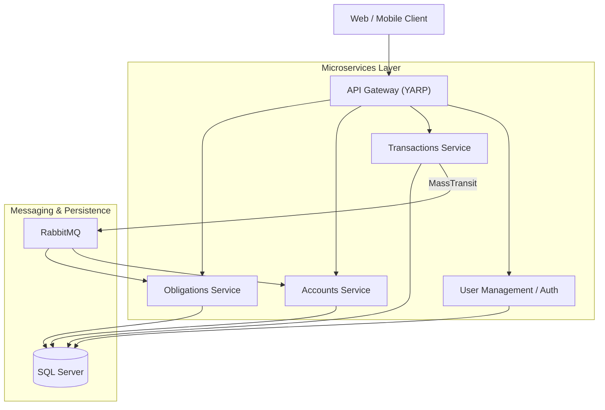

# 💰 Personal Finance Pro

[](https://turbo.build/)
[](https://nextjs.org/)
[](https://dotnet.microsoft.com/)

A high-performance, distributed personal finance management platform. Featuring real-time analytics, event-driven microservices, and a premium dashboard for comprehensive wealth tracking.

---

## 🏗️ Architecture

The platform follows a **Microservices Architecture** with an **API Gateway** pattern.

### System Request Flow


*   **API Gateway**: Central entry point using YARP to route requests and handle security.
*   **Decentralized Data**: Each service manages its own database schema within a shared SQL Server instance (logical separation).
*   **Event-Driven**: Asynchronous communication via RabbitMQ for cross-service consistency.

---

## ⚙️ Prerequisites

Ensure you have the following installed:
*   [Docker Desktop](https://www.docker.com/products/docker-desktop) (Required for all Docker options)
*   [.NET 8 SDK](https://dotnet.microsoft.com/download/dotnet/8.0) (For local backend dev)
*   [Node.js v20+](https://nodejs.org/) (For local web dev)
*   [Git](https://git-scm.com/)

---

## 🚀 Running the Application

### 🔹 Option 1: Local Development (IDE / CLI)
Run infrastructure in Docker, but services locally for debugging.

1.  **Start Infrastructure**:
    ```bash
    # From root, only start DB and RabbitMQ
    docker compose up -d sqlserver rabbitmq
    ```
2.  **Run Backend Services**:
    Open the solution in Visual Studio or use the CLI:
    ```bash
    cd apps/dotnet-services/PersonalFinanceServices
    dotnet run --project src/ApiGateway/PersonalFinance.ApiGateway
    ```
3.  **Run Frontend**:
    ```bash
    cd apps/web
    npm install
    npm run dev
    ```

### 🔹 Option 2: Docker Development (Debug Mode)
Best for testing the entire stack with **Hot Reload** enabled for .NET services.

```bash
docker compose -f docker-compose.yml -f docker-compose.dev.yml up --build
```
*   **Configuration**: `Debug`
*   **Hot Reload**: Enabled via `DOTNET_WATCH_ENABLED=true`
*   **Environment**: `Development`

### 🔹 Option 3: Production Mode (Docker)
Optimized for performance and stability. Services are built in `Release` mode.

```bash
docker compose up --build -d
```
*   **Configuration**: `Release`
*   **Environment**: `Production` (or `Docker`)
*   **Optimized**: Multi-stage builds produce slim images.

### 🔹 Option 4: Custom Project Name (Isolated Environment)
Recommended for maintaining multiple environments on the same host (e.g., `staging`, `testing`).

```bash
docker compose -p finance-flow up --build -d
```
*   **Namespace**: All containers and volumes will be prefixed with `finance-flow`.
*   **Isolation**: Prevents conflict with default project runs.

---

## 🌐 Access Points

| Component | URL | Description |
| :--- | :--- | :--- |
| **Web UI** | [http://localhost:3000](http://localhost:3000) | Main Frontend Application |
| **API Gateway** | [http://localhost:5000](http://localhost:5000) | Entry point for all APIs |
| **RabbitMQ UI** | [http://localhost:15672](http://localhost:15672) | Management Console (admin/admin123) |
| **SQL Server** | `localhost,1433` | Database Instance (sa/YourStrong@Passw0rd) |

---

## 🧠 Environment Configurations

### Global Environment Variables
| Variable | Description | Default |
| :--- | :--- | :--- |
| `ASPNETCORE_ENVIRONMENT` | Defines service behavior (Development/Docker/Production) | `Production` |
| `CONFIGURATION` | Build type (Debug/Release) | `Release` |
| `SA_PASSWORD` | SQL Server Admin password | `YourStrong@Passw0rd` |
| `RABBITMQ_DEFAULT_USER` | RabbitMQ login user | `admin` |
| `NEXT_PUBLIC_GATEWAY_URL` | Frontend pointer to API Gateway | `http://localhost:5000` |

---

## 🗄️ Volumes & Data Persistence

The project uses named volumes to ensure your financial data and message queues persist across container restarts.

*   `sqlserver_data`: Stores all SQL database files.
*   `rabbitmq_data`: Stores RabbitMQ queues and configurations.

> [!WARNING]
> Running `docker compose down -v` will delete these volumes and **wipe all data**. Use with caution.

---

## 🔧 Useful Commands

```bash
# View real-time logs for all services
docker compose logs -f

# Specific service logs
docker compose logs -f transactions

# Force rebuild without using cache
docker compose build --no-cache

# Clean up stopped containers and unused networks
docker system prune
```

---

## ⚠️ Common Issues & Fixes

*   **Database Connection Refused**: Services use a retry loop (10 attempts, 5s delay) to wait for SQL Server to boot. If it still fails, ensure no other process is using port `1433`.
*   **RabbitMQ Auth Failure**: Ensure the credentials in your `.env` or `appsettings.json` match the `RABBITMQ_DEFAULT_USER` in `docker-compose.yml`.
*   **Docker Build Context**: Ensure you run `docker compose` commands from the **root directory** of the repository.
*   **502 Bad Gateway**: If the frontend cannot reach the gateway, verify the `apigateway` container is running and healthy via `docker ps`.

---

## 🚀 Deployment Guide (VPS)

1.  **Clone the Repository**:
    ```bash
    git clone https://github.com/shuttergeek1928/personal-finance-app.git
    cd personal-finance-app
    ```
2.  **Set Production Secrets**: Update the passwords in `docker-compose.yml` to strong values.
3.  **Run Production Stack**:
    ```bash
    docker compose up --build -d
    ```
4.  **SSL/HTTPS (Recommended)**: Use Nginx as a reverse proxy with Certbot/Let's Encrypt to secure port `3000` and `5000`.

---
*Built with ❤️ for financial freedom.* 🚀
