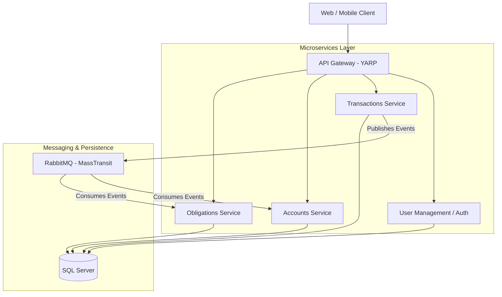
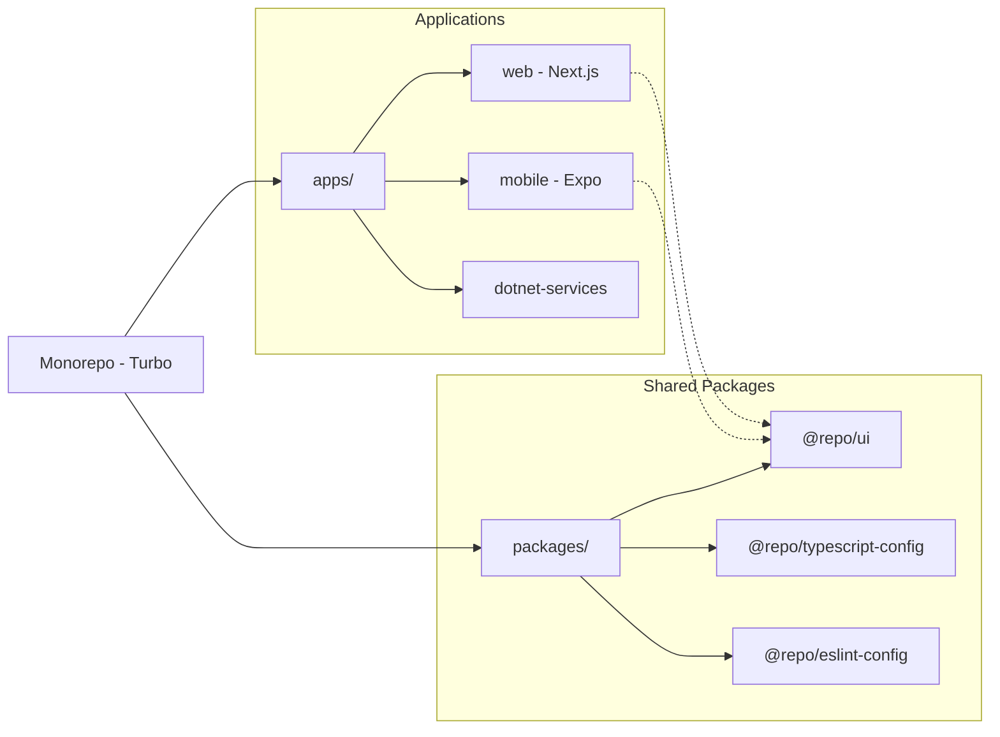

# 💰 Personal Finance Pro

[](https://turbo.build/)
[](https://nextjs.org/)
[](https://dotnet.microsoft.com/)
[](https://expo.dev/)

A high-performance, distributed personal finance management platform designed for the modern user. Featuring real-time analytics, event-driven microservices, and a state-of-the-art UI/UX.

---

## 🏗️ Architecture Overview

The platform is designed as a **decentralized microservices architecture**, leveraging event-driven communication for ultimate consistency and scalability.

### System Request Flow


### Monorepo Dependency Graph


---

## ✨ Core Features

### 📊 Unified Dashboard
*   **Financial Health Score**: Real-time algorithm assessing your savings rate, debt-to-income ratio, and asset health.
*   **30-Day Spending Intensity**: Heatmap visualization for daily expense patterns with fixed-height intensity shading.
*   **Cash Flow Trends**: Multi-axis Recharts analytics comparing income/expense velocity across time periods.

### 💳 Wealth Management
*   **Digital Wallet (Credit Cards)**: Ultra-realistic 3D-styled physical card UI with real-time limit and utilization tracking.
*   **Unified Accounts**: Centralized viewing of checking, savings, and credit accounts with peer-to-peer and inter-account transfers.
*   **Transaction Intelligence**: Server-side filtering, automatic categorization, and high-performance pagination.

### 🛠️ Obligation & Debt Tracking
*   **LIabilities / Loans**: Visual progress bars for EMI payments, principal reduction tracking, and automated schedules.
*   **Subscription Shield**: Detects and monitors recurring billing cycles (Netflix, SaaS, etc.) to prevent forgotten charges.

### 📱 Performance & Mobile
*   **Expo Mobile Client**: Native experience for iOS and Android with shared business logic and real-time push alerts.

---

## 🛠️ Technology Stack

| Layer | Technologies |
| :--- | :--- |
| **Frontend** | Next.js 15 (App Router), TypeScript, Tailwind CSS, Lucide React, Recharts, Zustand |
| **Mobile** | React Native, Expo, NativeWind, React Navigation |
| **Backend** | .NET 8, Web API, CQRS (MediatR), Entity Framework Core (SQL Server) |
| **Integrations** | MassTransit, RabbitMQ, Docker, Turbo |

---

## 🚀 Getting Started

### Prerequisites
*   [Node.js](https://nodejs.org/) (v18+)
*   [.NET SDK](https://dotnet.microsoft.com/download) (v8.0)
*   [Docker Desktop](https://www.docker.com/products/docker-desktop)
*   [Git](https://git-scm.com/)

### 1. Setup Infrastructure
Spin up the SQL Server and RabbitMQ instances using Docker:
```bash
cd apps/dotnet-services/PersonalFinanceServices/docker
docker-compose up -d
```

### 2. Run Backend Services
You can run the entire solution via Visual Studio or the CLI:
```bash
cd apps/dotnet-services/PersonalFinanceServices
dotnet run --project src/ApiGateway/PersonalFinance.ApiGateway
# Repeat for other services in /src/Services
```

### 3. Run Web App
```bash
# From the root directory
npm install
npm run dev --workspace=web
```

### 4. Run Mobile App
```bash
cd apps/mobile
npm install
npm start
```

---

## 📄 License
This project is licensed under the MIT License - see the `LICENSE` file for details.

---
*Built with ❤️ for financial freedom.* 🚀
